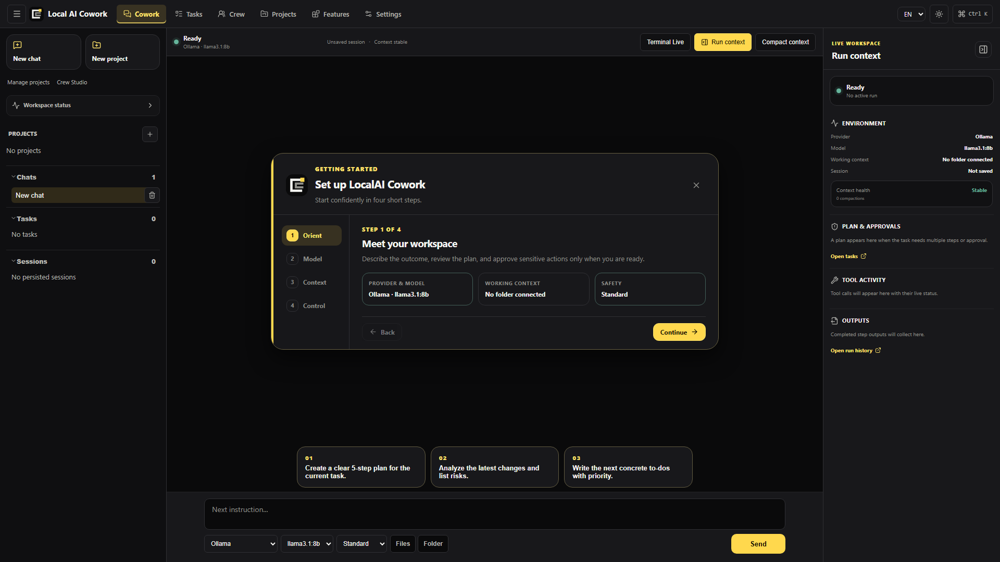

<p align="center">
  
</p>

# LocalAI Cowork

**The open-source, local-first AI coworker for Windows.** LocalAI Cowork combines tasks, files, local or hosted models, MCP tools, approvals, and reusable workflows in one inspectable desktop application.

It is an independent open-source alternative for people who like the outcome-driven approach of Claude Cowork and Microsoft Copilot Cowork, but want Ollama support, model choice, and source they can inspect and modify. It is early-stage software—not a claim of feature parity with either commercial product.

LocalAI Cowork is an independent project. It is not affiliated with or endorsed by Anthropic, Microsoft, or the separate [LocalAI](https://localai.io/) project.

[Website](https://noshitcoding.github.io/LocalAI-Cowork/) · [Download](https://github.com/noshitcoding/LocalAI-Cowork/releases/latest) · [Report a bug](https://github.com/noshitcoding/LocalAI-Cowork/issues/new?template=bug_report.yml) · [Request a feature](https://github.com/noshitcoding/LocalAI-Cowork/issues/new?template=feature_request.yml) · [Security](SECURITY.md)



## Why This Exists

Most AI work happens in separate browser tabs, terminals, file explorers, and local tools. LocalAI Cowork brings those pieces into a desktop app that can keep context, ask for approval before risky actions, and work with local or self-hosted model providers.

No LocalAI Cowork account is required. Use Ollama for local model execution or connect a compatible provider when a hosted model fits the task better.

The project is early, but already usable as a Windows-first Tauri app. Start with non-sensitive copies of files and review AI-generated work before relying on it.

## Highlights

- Local desktop app built with Tauri, React, TypeScript, and Rust
- Chat workspace with persistent sessions, message history, and streaming output
- Local Ollama support with health checks, model selection, and configurable timeouts
- OpenAI-compatible and OpenRouter profile support
- MCP server management with probing and tool execution
- File and folder context for chat tasks
- Task lifecycle with approval states, progress, and audit events
- Skills, prompt templates, runtime instructions, and reusable workflows
- Terminal, process, memory, insight, and pipeline panels
- Windows installer workflow for tagged releases

## Current Scope

LocalAI Cowork is aimed at local and network-internal AI workflows. It is not a hosted SaaS and does not require a separate web server in normal desktop use.

The current implementation is strongest on Windows. The Tauri stack can support more platforms later, but the installer and smoke tests are Windows-focused.

## Quick Start

### Prerequisites

- Windows 10 or Windows 11
- Node.js 22+
- npm 10+
- Rust via rustup
- Microsoft WebView2 Runtime
- Ollama, if you want local model execution

### Run The App In Development

```powershell
cd app
npm install
npm run tauri dev
```

### Build A Windows Installer

```powershell
cd app
npm run installer
```

The packaged installer is written to:

```text
dist-installers/LocalAI-Cowork-Setup.exe
```

The original Tauri NSIS output remains under:

```text
app/src-tauri/target/release/bundle/nsis/
```

### Regenerate Brand Assets

The canonical Carbon Signal mark lives in `brand/open-workframe.svg`. Regenerate the web favicon, social preview, and all Tauri icon sizes from that master:

```powershell
cd app
npm run brand:assets
```

## Ollama Setup

LocalAI Cowork defaults to a local Ollama endpoint:

```text
http://localhost:11434
```

Example local model setup:

```powershell
ollama serve
ollama pull llama3.1:8b
```

You can change endpoint, model, timeout, context window, and temperature from the app settings.

## MCP Example

The repository includes a local DuckDuckGo web-search MCP server:

```text
Name: duckduckgo-websearch
Command: node
Args: scripts/mcp/duckduckgo-websearch-server.mjs
Tool: search_web
```

Common environment options:

- `DDG_MAX_RESULTS`, default `5`
- `DDG_REGION`, default `wt-wt`
- `DDG_SAFESEARCH`, default `moderate`
- `DDG_TIMEOUT_MS`, default `10000`

## Project Layout

```text
app/          Tauri desktop app, React frontend, Rust backend
docs/         Public user and integration documentation
scripts/      Repository-level validation helpers
.github/      CI, release automation, and community templates
site/         Public product website and search metadata
```

## Useful Commands

```powershell
cd app
npm run doctor
npm run lint
npm run typecheck
npm run test:ci
npm run build
```

Rust checks:

```powershell
cd app/src-tauri
cargo check
cargo test
cargo clippy -- -D warnings
```

Desktop smoke test:

```powershell
cd app
npm run smoke:desktop
```

## Documentation

- [Ollama configuration](docs/OLLAMA_CONFIGURATION.md)
- [Desktop control and computer use](docs/DESKTOP_CONTROL_AND_COMPUTER_USE.md)

## Release Workflow

The GitHub Actions workflow in `.github/workflows/windows-installer.yml` builds the Windows installer and attaches it to a GitHub Release when a version tag is pushed.

```powershell
git tag v0.1.8
git push origin v0.1.8
```

The tag must match the shared npm, Cargo, and Tauri version. The release gate reruns all tests and vulnerability scans, signs and verifies the installer with the pinned Authenticode certificate, then publishes it with CycloneDX SBOM, third-party notices, offline provenance, SHA-256 sums, and GitHub build/SBOM attestations. The signing step requires the repository secrets `LOCALAI_COWORK_CODESIGN_PFX_BASE64`, `LOCALAI_COWORK_CODESIGN_PASSWORD`, and `LOCALAI_COWORK_CODESIGN_THUMBPRINT`; missing or invalid signing evidence blocks publication. During the rename transition, the workflow also accepts the legacy `OPEN_COWORK_*` secret names so existing protected values do not have to be exposed or copied. Manual release builds are available through the workflow dispatch input.

## Contributing

Contributions are welcome while the project is still taking shape. Start with [CONTRIBUTING.md](CONTRIBUTING.md), run the local checks before opening a pull request, and keep changes focused.

## License And Disclaimer

LocalAI Cowork is licensed under the [Apache License, Version 2.0](LICENSE).

Attribution notices are provided in [NOTICE](NOTICE). Warranty and liability
limitations are included in Sections 7 and 8 of the Apache License, Version
2.0, with an additional plain-language summary in [DISCLAIMER.md](DISCLAIMER.md).
