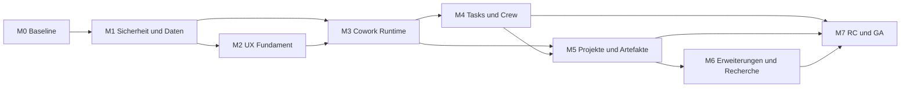

# Open Cowork: Production Master Plan

Stand: 2026-07-10

## 1. Zielbild

Open Cowork wird eine Windows-first, local-first Desktop-Arbeitsumgebung fuer anspruchsvolle KI-Arbeit. Der Produktvorteil soll nicht aus einer moeglichst langen Featureliste entstehen, sondern aus fuenf nachweisbaren Staerken:

1. Transparente Ausfuehrung: Jeder Plan, Tool-Aufruf, Agentenlauf, Kostenpunkt und jedes Artefakt ist nachvollziehbar.
2. Kontrollierbare Autonomie: Nutzer koennen Rechte, Modelle, Budgets, Freigaben und Arbeitsordner exakt steuern.
3. Durchgaengiger Arbeitsfluss: Chat, Tasks, Crews, Projekte, Recherche und Artefakte greifen ohne Medienbruch ineinander.
4. Lokale Datensouveraenitaet: Lokale Modelle und Datenhaltung sind vollwertig; Cloud-Anbieter bleiben optional.
5. Produktionsqualitaet: Installation, Updates, Recovery, Sicherheit, Barrierefreiheit, Performance und Support sind Teil des Produkts.

Der erste GA-Release ist eine belastbare Einzelplatz-Desktop-App fuer Windows 10/11. Mobile Dispatch, Flottenverwaltung, GPO/MDM und ein oeffentlicher Plugin-Marktplatz folgen erst nach GA.

## 2. Verifizierter Ausgangspunkt und Fortschritt

Die folgende Bestandsaufnahme beschreibt den geprueften Ausgangspunkt vom 9. Juli 2026. Der aktuelle, danach erreichte Stand wird unmittelbar darunter fortgeschrieben, damit erledigte Blocker nicht aus dem historischen Befund verschwinden.

Bereits tragfaehig:

- React 19, TypeScript, Tauri 2, Rust und SQLite bilden eine sinnvolle Windows-Desktop-Basis.
- Die sechs Produktflaechen Cowork, Tasks, Crew, Projects, Features und Settings sind vorhanden.
- LLM-Provider, Tool-Nutzung, MCP, Memory, Tasks, Scheduler, Crews, Projekte und Terminal sind funktional angelegt.
- Typecheck, ESLint, 219 Frontend-Tests, Frontend-Build, Build-Budgets, `cargo check`, 64 Rust-Tests und Clippy bestehen lokal.
- Ein Windows-Installer-Workflow und grundlegende Security-Scans existieren.

Unmittelbare Release-Blocker:

- `doctor:ci` ist unter Windows wegen der Aufloesung von `npm` statt `npm.cmd` fehlerhaft.
- Das i18n-Audit findet zwei fehlende UI-Schluessel; die Oberflaeche ist noch nicht vollstaendig sprachrein.
- Der lokale Terminal-Runner ignoriert seinen Timeout; weitere sichtbare Backends sind noch nicht implementiert.
- Kritische Views und Backend-Dateien sind zu gross und koppeln UI, Orchestrierung und Persistenz zu eng.
- Es fehlen belastbare Desktop-E2E-, Recovery-, Migrations-, Abuse- und Installer-Upgrade-Tests.
- Dateirechte, Secrets, Tool-Sandbox, Redaction und Audit-Events sind noch keine durchgaengige Sicherheitsgrenze.
- Features wie Global Search, Artefakt-/Diff-Preview und Plugin-Lifecycle sind nur geplant oder teilweise vorhanden.
- Crash-Recovery, Auto-Update, Codesignierung, Support-Bundle und messbare Runtime-SLOs fehlen.

Verifizierter Umsetzungsstand am 11. Juli 2026:

- M0 ist lokal reproduzierbar gruen: `npm run verify` umfasst Doctor, Release-/Supply-Chain-Tests, Versions-/Lizenzpolitik, TypeScript, ESLint, i18n, 233 Frontend-Tests, Produktionsbuild und Budgets, Cargo Check, mehr als 140 Rust-Tests und Clippy.
- Doctor und i18n sind repariert; Englisch und Deutsch enthalten jeweils 1266 vollstaendige Schluessel.
- Terminal-Timeout und Cancel beenden den vollstaendigen Prozessbaum; Output und Laufzeit sind begrenzt und unter Windows durch Job Objects abgesichert.
- Datei-, Root-, Backup-, Junction-/Symlink-, Sandbox-, Shell- und Toolset-Grenzen werden backendseitig erzwungen und durch Abuse-Tests belegt.
- Autonome Netzwerktools besitzen SSRF-, DNS-Rebinding-, Redirect-, Proxy-, Content-Type-, Zeit- und Groessen-Schutz.
- SQLite besitzt WAL, `FULL`-Synchronisierung, Integritaetspruefungen, transaktionale Migrationen und verifizierte Pre-Migration-Backups.
- Provider-, Connector-, Crew-, Engine- und MCP-Secrets werden aus Klartext-localStorage in Windows Credential Manager migriert. Frontend- und Backend-Auditpfade sowie persistierte App-/Crew-Logs werden zentral redigiert; Exporte enthalten keine Provider-Schluessel.
- Frei strukturierte Terminal-, Memory-Provider-, Tool-Gateway- und Sandbox-Konfigurationen liegen als revisionsgebundene Gesamt-Blobs im Windows Credential Manager; SQLite und WebView-Listen enthalten nur typisierte Referenzen. Browser-Fallbacks sind secretfrei und Altbestaende werden vor dem ersten Produkt-Screen migriert.
- Engine-, Scheduler-, Crew- und Audit-Diagnosesinks erzwingen backendseitig Redaction, UTF-8-sichere Groessenlimits und Retention. JSONL-Audit rotiert serialisiert; der Gateway-Tail redigiert erneut.
- Das Support-Bundle ist als manifestiertes Whitelist-ZIP in den Systemeinstellungen verfuegbar. Automatisierte Leak-Tests belegen, dass unbekannte Sentinel-Felder, Audit-Details und Datenbankinhalte nicht exportiert werden.
- Das rotierte JSONL-Audit besitzt eine versionierte HMAC-SHA-256-Kette mit backend-only Windows-Credential-Schluessel und externem Historienmarker. Startup, Gateway-Tail und Support-Export verifizieren vor dem Lesen; Tamper-, Loesch-, Reorder-, Truncation-, Legacy-, Restart- und Rotationstests belegen den Vertrag und sein dokumentiertes Angreifermodell.
- Startup-Recovery reconciliiert neun aktive Zustandsklassen vor dem Scheduler-Start transaktional und idempotent. Crew- und Scheduler-Runs werden vor externer Ausfuehrung persistiert; Scheduler-Claims verhindern Ueberlappung und unkontrollierte Crash-Replays.
- Hintergrundprozesse besitzen Exit-Monitoring und einen an die App-Lebenszeit gebundenen Prozessbaum; normale Exits, Stop und App-Abbruch hinterlassen keine falschen `running`-Zustaende.
- npm- und RustSec-Vulnerabilities sind auf null reduziert. Versionen und Rust-Floor sind konsistent gepinnt; SPDX-Lizenzpolitik, immutable Workflow-Actions, CycloneDX-SBOM, Drittanbieterhinweise, Offline-Provenienz, SHA256SUMS sowie GitHub-signierte Build-/SBOM-Attestierungen sind blockierende Release-Vertraege.
- Der reale Windows-NSIS-Installer fuer `0.1.7` baut lokal erfolgreich mit gepinntem Rust 1.89 und konsistenter Tauri-2.11-Linie; PE-Header und SHA-256 sind verifiziert. Die fail-closed Authenticode-Integration signiert vor Provenienz und Publikation, pinnt den Zertifikat-Thumbprint, erzwingt SHA-256, RFC-3161-Timestamp und Policy-Verifikation und besteht einen ephemeren PE-Signatur-Smoke-Test. Das lokale Release-Artefakt bleibt ohne bereitgestelltes oeffentliches Zertifikat erwartbar `NotSigned`.
- Die Produktvertraege fuer Datei-, Netzwerk-, Datenbank-, Credential-, Observability-, Recovery-, Audit- und Release-Sicherheit liegen unter `docs/product/runtime-contracts` und bestehen den Dokumentationsvalidator mit 137 Katalogeintraegen.
- Der statische Features-Kartenbildschirm ist durch einen operativen Workbench fuer MCP, Wissensdatenbank, Skills und Slash-Befehle ersetzt. Wissensimporte werden begrenzt und ueberlappend segmentiert, natuerlichsprachliche Retrieval-Anfragen termbasiert gerankt und automatisch in Chat- sowie Crew-Kontext aufgenommen. Neue Crews enthalten standardmaessig einen direkt startbaren Plan-/Execute-/Review-Graphen; MCP-Einmalaufrufe bestehen den strikten Initialize-/Initialized-Handshake.

Verbleibende M1- und GA-Blocker:

- Ein vollstaendiges systemweites Threat Model ueber Audit hinaus, Desktop-Crash-Recovery-E2E- und Installer-Upgrade-Tests fehlen noch.
- Beschaffung und Secret-Konfiguration des oeffentlich vertrauenswuerdigen Windows-Codesigning-Zertifikats samt erstem timestamp-validierten RC, Auto-Update, Runtime-SLOs, Barrierefreiheit und visuelle Regressionen sind vor GA weiterhin release-blockierend.

## 3. Produkt- und Architekturentscheidungen

Diese Entscheidungen gelten fuer die Umsetzung und verhindern spaetere Grundsatzdebatten:

- Local-first bleibt Standard. Telemetrie ist opt-in und uebertraegt standardmaessig keine Prompt-, Datei- oder Tool-Inhalte.
- SQLite bleibt die lokale Datenbank. Schemaaenderungen laufen ausschliesslich ueber versionierte, getestete Migrationen.
- React-Komponenten koordinieren keine langlaufende Ausfuehrungslogik. Runs, Scheduler und Tool-Ausfuehrung werden als Services mit klaren Ports modelliert.
- Tauri-Commands verwenden versionierte Request-/Response-Vertraege. Rust-Typen und TypeScript-Zod-Schemas werden gegeneinander getestet.
- Jeder agentische Lauf wird als persistente State Machine behandelt: `queued`, `planning`, `waiting_approval`, `running`, `waiting_user`, `paused`, `succeeded`, `failed`, `cancelled`, `interrupted`.
- Tool-Zugriff wird backendseitig erzwungen. UI-Schalter allein gelten nie als Sicherheitskontrolle.
- Provider, Modelle, Crews, Skills und Tools referenzieren stabile IDs statt Anzeigenamen.
- Unfertige Funktionen werden nicht als funktionsfaehige Controls angezeigt. Sie sind entweder hinter einem klaren Experimental-Flag oder nicht sichtbar.
- Die App bleibt auf Deutsch und Englisch vollstaendig bedienbar. Neue sichtbare Texte muessen von Beginn an i18n-Schluessel verwenden.

## 4. Ziel-Domaenen und neue Vertraege

Folgende gemeinsame Typen werden als stabile Produktvertraege eingefuehrt oder vereinheitlicht:

- `Run`, `RunStep`, `RunEvent`, `RunCheckpoint` fuer persistente und wiederaufnehmbare Ausfuehrungen.
- `ApprovalRequest` und `ApprovalDecision` mit Scope, Risiko, Ablaufzeit und Begruendung.
- `ExecutionPolicy` mit erlaubten Roots, Tools, Hosts, Befehlen, Budgets und Freigabestufen.
- `ProviderProfile`, `ModelProfile` und `ModelCapabilities` mit Health-, Kontext-, Tool- und Kostenmetadaten.
- `Artifact`, `ArtifactVersion` und `ArtifactProvenance` fuer Dateien, Berichte, Tabellen, Praesentationen und Diffs.
- `ScheduledJob`, `ScheduleTrigger`, `RetryPolicy` und `MissedRunPolicy` fuer robuste Zeitplanung.
- `CrewDefinition`, `CrewMember`, `CrewRunGraph` und `Handoff` fuer Multi-Agent-Orchestrierung.
- `CapabilityManifest` fuer Skills, MCP-Server, Plugins und Connectors.
- `AuditEvent`, `HealthCheckResult` und `SupportBundleManifest` fuer Betrieb und Diagnose.

SQLite erhaelt dafuer migrationsgesicherte Tabellen fuer Runs, Run Events, Approvals, Artifacts, Artifact Versions, Policies, Schedules, Audit Events und Secrets-Referenzen. Secrets selbst liegen im Windows Credential Manager, nicht in SQLite oder Logs.

## 5. Themengebiete und Feature-Plan

### A. App Shell, Navigation und Designsystem - P0

Umsetzung:

- Informationsarchitektur vereinheitlichen: primaere Navigation links, kontextbezogene Aktionen in der View, Laufstatus global sichtbar.
- Seitenleisten, Terminal und zuletzt gewaehlte Ansicht pro Workspace persistieren.
- Leere, ladende, fehlerhafte, offline und schreibgeschuetzte Zustaende fuer jede Route definieren.
- `App.css` in Tokens, Layout, Komponenten und routebezogene Styles zerlegen; wiederverwendbare Controls dokumentieren.
- Keyboard-first Navigation, konsistente Fokusindikatoren, Skip-Ziele, Screenreader-Namen und reduzierte Bewegung umsetzen.
- Fenster ab 900 x 650 px ohne Ueberlappungen unterstuetzen; breite Ansichten fuer Informationsdichte nutzen.

Abnahme: Alle sechs Routen sind per Tastatur vollstaendig bedienbar, bestehen automatisierte axe-Pruefungen und bleiben bei 900 x 650 sowie 1920 x 1080 ohne abgeschnittene Kernaktionen nutzbar.

### B. Onboarding und erster Erfolg - P0

Umsetzung:

- Gefuehrter Start fuer Sprache, Datenordner, Provider, Modelltest, Arbeitsordnerrechte und Datenschutz.
- Automatische Diagnose mit konkreten Reparaturaktionen fuer Ollama, Cloud-Profile, WebView2 und Schreibrechte.
- Erster Beispieltask wird real ausgefuehrt und erzeugt ein pruefbares Artefakt.
- Onboarding bleibt ueberspringbar und jederzeit erneut startbar.

Abnahme: Ein neuer Nutzer gelangt auf sauberem Windows in hoechstens fuenf Minuten von Installation zu einem erfolgreichen, nachvollziehbaren Lauf.

### C. Cowork Chat und Run Experience - P0/P1

Umsetzung:

- `CoworkView` in Composer, Message Timeline, Run Header, Approval Queue, Tool Trace, Artifact Rail und Provider Selector zerlegen.
- Senden, Streaming, Stoppen, Wiederholen, Bearbeiten, Forken und Fortsetzen als explizite Zustandsuebergaenge implementieren.
- Tool Calls als Timeline mit Input-Zusammenfassung, Output, Dauer, Risiko, Freigabe, Retry und Fehler anzeigen.
- `AskUser` als robuste Warteschlange mit Resume nach App-Neustart behandeln.
- Quellen, Dateianhaenge, Projektkontext und genutzte Memories pro Antwort sichtbar machen.
- Lange Threads automatisch kompaktieren, dabei Zusammenfassung und verworfene Kontextanteile transparent anzeigen.
- Runs koennen als reproduzierbare Vorlage oder Task gespeichert werden.

Abnahme: Ein Lauf kann in jedem Zustand abgebrochen und nach Absturz konsistent als `interrupted` wiederhergestellt werden; kein doppelter Tool-Aufruf nach Resume.

### D. Agent Runtime und Orchestrierung - P0/P1

Umsetzung:

- `QueryEngine` hinter ein `AgentRuntime`-Interface stellen und Provider-, Tool-, Approval- und Persistence-Ports trennen.
- Persistente Run-State-Machine mit idempotenten Events, Checkpoints, Cancellation Token und begrenzten Retries einfuehren.
- Parallelitaet, Token-/Zeit-/Kostenbudgets und maximale Tool-Schritte pro Run konfigurierbar machen.
- Plan-only, approval-required und trusted-execution als klar benannte Policies anbieten.
- Fehler klassifizieren: Nutzerfehler, Providerfehler, Toolfehler, Policy-Verstoss, Timeout und interner Fehler.
- Recovery darf nur idempotente Schritte automatisch wiederholen; mutierende Schritte verlangen eine Entscheidung.

Abnahme: Contract- und Fault-Injection-Tests beweisen Cancel, Pause, Resume, Retry, Crash-Recovery und Budgetabbruch ohne inkonsistenten Zustand.

### E. Provider- und Modellverwaltung - P0/P1

Umsetzung:

- Mehrere Profile fuer Ollama, OpenAI-kompatible Anbieter, Anthropic und OpenRouter parallel verwalten.
- Health, Latenz, Kontextfenster, Tool Calling, Vision, strukturierte Ausgabe und Kosten automatisch oder manuell erfassen.
- Standardprofile global, pro Projekt, pro Task, pro Crew und pro Crew-Mitglied ueberschreibbar machen.
- Secrets ueber OS-Keychain referenzieren; Import/Export enthaelt niemals Klartextschluessel.
- Modellkompatibilitaet vor einem Lauf pruefen und verstaendliche Fallbacks anbieten.

Abnahme: Providerwechsel erfordert keinen Neustart; ein nicht erreichbares Modell fuehrt zu einer kontrollierten Auswahl oder einem definierten Fallback, nie zu einem stillen Wechsel.

### F. Tools, Dateisicherheit und Ausfuehrung - P0

Umsetzung:

- Alle Pfade kanonisieren und Zugriff ausschliesslich innerhalb freigegebener Roots erlauben; Junction-/Symlink-Escapes testen.
- Lesen, Schreiben, Ueberschreiben, Verschieben und Loeschen getrennt berechtigen.
- Vor mutierenden Dateioperationen Diff und betroffene Dateien anzeigen; Batch-Aktionen erhalten Backup und Rollback.
- Terminal-Timeout wirklich erzwingen, Prozessbaeume beenden und Output-/Speichergrenzen setzen.
- Nicht implementierte Container-, SSH-, HPC- und Serverless-Backends aus der normalen UI entfernen, bis sie end-to-end funktionieren.
- Netzwerktools erhalten URL-/Host-Policies, SSRF-Schutz, Downloadlimits und Content-Type-Pruefung.
- Jeder Tool Call erzeugt ein redigiertes Audit Event mit Run-, Policy- und Ergebnisbezug.

Abnahme: Abuse-Tests koennen weder erlaubte Roots verlassen noch Secrets in Logs schreiben; Timeout und Cancel beenden Kindprozesse innerhalb von zwei Sekunden.

### G. Work Tasks und Scheduler - P0/P1

Umsetzung:

- Task-Liste, Erstellung, Detail, Run Toolbar und Scheduler als eigenstaendige, testbare Module abschliessen.
- Status, Prioritaet, Tags, Projekt, Verantwortlicher, Provider, Crew, Budget und erwartete Outputs als strukturierte Felder fuehren.
- Suchbare Filter, gespeicherte Ansichten, Mehrfachauswahl und nachvollziehbare Run-Historie ergaenzen.
- Einmalige und Cron-basierte Schedules mit Zeitzone, naechstem Lauf, Retry, Backoff und Missed-Run-Policy modellieren.
- Scheduler-Claiming transaktional und idempotent machen, damit ein Job nie doppelt startet.
- Task-Abhaengigkeiten und blockierte Tasks erst nach stabiler Scheduler-Basis einfuehren.

Abnahme: Neustart, Zeitzonenwechsel und verpasster Termin erzeugen genau das konfigurierte Verhalten; jeder Run bleibt dem ausloesenden Task und Schedule zugeordnet.

### H. Crew und Multi-Agent-System - P1

Umsetzung:

- Crew-Definitionen mit Rollen, Zielen, aktiviert/deaktiviert, Provider, Modell, Toolscope, Parallelitaet und Budget pro Mitglied anbieten.
- Sequenzielle, parallele und managergefuehrte Ausfuehrung als drei explizite Strategien implementieren.
- Handoffs strukturiert mit Auftrag, Kontext, Artefakten und Abnahmekriterium uebergeben.
- Live-Ansicht als Run-Graph mit aktiven, wartenden, fehlgeschlagenen und abgeschlossenen Agenten darstellen.
- Abbruch, Teil-Retry und Austausch eines fehlgeschlagenen Mitglieds unterstuetzen.
- Crew-Templates fuer Recherche, Coding, Review und Office-Erstellung mit sicheren Defaults liefern.

Abnahme: Nutzer koennen Modell und Rechte jedes Mitglieds festlegen; ein Agentenfehler erzwingt keinen kompletten Neustart, und das Endergebnis zeigt Beitraege sowie Kosten je Mitglied.

### I. Projekte und Kontext - P1

Umsetzung:

- Projekt als Container fuer Instruktionen, freigegebene Roots, Ressourcen, Threads, Tasks, Crews, Providerdefaults und Artefakte schaerfen.
- Ressourcenindex mit Typ, Quelle, Aktualitaet, Groesse und Einbeziehungsstatus anbieten.
- Projektkontext deterministisch und mit sichtbarem Tokenbudget zusammensetzen.
- Archivieren, Exportieren, Importieren und sicheres Loeschen inklusive Abhaengigkeitsvorschau ergaenzen.
- Projekt-Dashboard zeigt laufende Arbeit, letzte Ergebnisse, offene Freigaben und Fehler statt dekorativer Kennzahlen.

Abnahme: Export und Reimport eines Projekts erhalten alle nicht geheimen Daten und Referenzen; entfernte Ressourcen gelangen nicht mehr in neue Prompts.

### J. Artefakte, Diffs und Office - P1/P2

Umsetzung:

- Jede relevante Ausgabe als `Artifact` mit Typ, Version, Erzeuger, Run, Quellen und Speicherort registrieren.
- Markdown, Text, Code, Bilder, PDF, CSV und Diffs direkt sicher anzeigen; Office-Dateien ueber gerenderte Vorschau pruefen.
- Versionen vergleichen, akzeptieren, verwerfen, oeffnen, im Explorer zeigen und auf eine vorige Version zuruecksetzen.
- DOCX, XLSX und PPTX ueber Templates, strukturierte Erzeugung und Render-QA statt blossem Dateiexport erstellen.
- Artefakt-Suche und Projekt-/Task-Zuordnung integrieren.

Abnahme: Jeder mutierende Run produziert entweder ein versioniertes Artefakt/Diff oder dokumentiert explizit, warum keines entstand; Office-Ausgaben durchlaufen einen visuellen Qualitaetscheck.

### K. Globale Suche und Command Palette - P1

Umsetzung:

- SQLite FTS5 ueber Threads, Messages, Tasks, Runs, Artefakte, Skills, Settings und Logs aufbauen.
- Suche mit Typ-, Projekt-, Zeit- und Statusfiltern sowie Tastaturnavigation anbieten.
- Command Palette mit Routen, letzten Aktionen, Settings, Skill-Commands und kontextbezogenen Befehlen zusammenfuehren.
- Treffer muessen zum exakten Kontext navigieren und passende Aktionen anbieten.

Abnahme: Typische Treffer erscheinen bei 50.000 indexierten Datensaetzen in unter 150 ms P95; Index-Rebuild blockiert die UI nicht.

### L. Memory und Personalisierung - P1/P2

Umsetzung:

- Memories nach global, Projekt, Crew und Task-Template scopen; Herkunft, Vertrauen, letzte Nutzung und Ablaufzeit speichern.
- Nach Runs nur Vorschlaege erzeugen: merken, als Skill speichern, nicht wieder fragen oder als Vorlage speichern.
- Nutzer bestaetigen dauerhafte Memories; widerspruechliche oder sensible Eintraege werden markiert.
- Memory-Nutzung pro Antwort sichtbar und widerrufbar machen.
- Semantische Suche bleibt optional; die App funktioniert vollstaendig ohne Embedding-Dienst.

Abnahme: Keine dauerhafte Praeferenz entsteht ohne nachvollziehbare Zustimmung; Loeschen entfernt sie aus Index und zukuenftigen Kontexten.

### M. Skills, MCP, Plugins und Connectors - P1/P2

Umsetzung:

- Skills aus Markdown plus YAML-Frontmatter validieren, beobachten und ohne Neustart neu laden.
- MCP-Lifecycle mit Start, Stop, Restart, Health, Auto-Reconnect, Logs, Toolliste und Berechtigungen fertigstellen.
- `CapabilityManifest` definiert Version, Quelle, Rechte, Tools, Netzwerkzugriff und Kompatibilitaet.
- Plugins zuerst als isolierte Child-Prozesse mit restriktivem IPC-Vertrag umsetzen; In-Process-Ausfuehrung vermeiden.
- Installieren, Aktivieren, Deaktivieren, Aktualisieren, Testen und Entfernen transaktional gestalten.
- Signaturen und vertrauenswuerdige Quellen vor einem oeffentlichen Katalog einfuehren.

Abnahme: Defekter Skill/MCP/Plugin kann weder den App-Start verhindern noch still Rechte erweitern; Lifecycle-Aktionen sind rollbackfaehig und auditierbar.

### N. Browser, Recherche und Quellen - P2

Umsetzung:

- Rechercheflow aus Suche, Fetch, Browser-Automation, Quellenextraktion und Artefaktbildung standardisieren.
- Browser-Automation ueber eine bewaehrte Playwright-Laufzeit mit Domainfreigaben und sichtbaren Aktionen ausfuehren.
- Quellen erhalten URL, Titel, Autor/Datum soweit verfuegbar, Abrufzeit und zitierbare Fundstellen.
- Downloads, Login-Aktionen, Formulare und externe Schreibaktionen getrennt freigeben.

Abnahme: Ein Recherchebericht laesst jede wesentliche Aussage bis zur gespeicherten Quelle zurueckverfolgen; blockierte Domains und Schreibaktionen koennen nicht umgangen werden.

### O. Settings, Features und Diagnose - P0/P1

Umsetzung:

- Settings in Basic und Advanced gliedern, ohne Funktionen zu verlieren; Suche und Deep Links ergaenzen.
- Konfigurationen inline validieren und ungespeicherte Aenderungen deutlich machen.
- Features-Seite vom statischen Kartenraster zum Capability Center umbauen: Status, Abhaengigkeit, Health, Rechte, Aktion und Dokumentation.
- Zentrale Diagnostics-Seite mit Provider-, DB-, Scheduler-, MCP-, Tool- und Runtime-Health sowie redigiertem Support-Bundle anbieten.
- Experimental-Features klar markieren und standardmaessig deaktivieren.

Abnahme: Jede fehlerhafte Kernkonfiguration ist diagnostizierbar und verweist auf eine konkrete Reparatur; Support-Bundles enthalten keine Secrets oder Promptinhalte.

### P. Daten, Backend und Migrationen - P0

Umsetzung:

- `lib.rs` und `db.rs` in Commands, Domain Services, Repositories, Migrations und Infrastrukturmodule zerlegen.
- SQLite mit WAL, Foreign Keys, Busy Timeout, Integritaetscheck, kontrollierten Transaktionen und Backup vor Migration betreiben.
- Jede Migration vorwaerts, gegen reale Altstaende und auf Fehler-Rollback testen.
- Store-Hydration zentral koordinieren; partielle Ladefehler duerfen andere Bereiche nicht unbrauchbar machen.
- Import/Export-Format versionieren und Abwaertskompatibilitaet dokumentieren.

Abnahme: Upgrade von den letzten drei veroeffentlichten Versionen erhaelt Daten; simulierter Stromausfall waehrend Schreiben oder Migration fuehrt zu Recovery statt stiller Korruption.

### Q. Security und Datenschutz - P0/P1

Umsetzung:

- Threat Model fuer Dateien, Shell, MCP, Provider, Browser, Plugins, Updates und lokale Daten erstellen.
- Zentrale Policy Engine mit deny-by-default, Prioritaetsregeln und backendseitiger Enforcement einfuehren.
- Secrets, PII und sensible Pfade vor Logs, Telemetrie und Support-Bundles redigieren.
- Audit-Log manipulationsarm, filterbar und exportierbar machen; klare Aufbewahrungs- und Loeschregeln definieren.
- Dependency- und License-Scanning als blockierende CI-Gates betreiben; `npm audit` nicht mehr ignorieren.
- Installer, Update-Manifeste und Binaries signieren; Updatequellen fest pinnen.

Abnahme: Keine offene Critical/High-Schwachstelle ohne dokumentierte Ausnahme; alle kritischen Abuse-Cases sind automatisiert getestet und im Threat Model abgedeckt.

### R. Performance, Stabilitaet und Observability - P0/P1

Umsetzung:

- Strukturierte Logs mit Correlation IDs fuer Run, Task, Crew, Tool und Provider einfuehren.
- Lokale Metriken fuer Start, Navigation, Queue, Providerlatenz, Tooldauer, Fehler und Speicher erfassen.
- Opt-in OpenTelemetry nur fuer technische Metadaten vorsehen.
- Queues und Backpressure fuer parallele Runs, MCP Calls und Terminalprozesse definieren.
- Route-, Editor- und Preview-Code lazy laden; grosse UI-Module aufteilen und Re-Render messen.
- Crash-Handler, Session Restore und redigiertes Support-Bundle fertigstellen.

Abnahme auf definierter Windows-Referenzhardware:

- Warmstart bis interaktive Shell: <= 2,5 s P95.
- Routennavigation: <= 150 ms P95.
- Suchantwort lokal: <= 150 ms P95.
- Cancel bis Prozessende: <= 2 s P95.
- Initiales Frontend-JS: <= 300 KiB gzip; kein Chunk > 120 KiB gzip.
- Keine verlorenen bestaetigten Daten nach erzwungenem Prozessabbruch.

### S. QA, CI und Release Engineering - P0

Umsetzung:

- Windows-Doctor reparieren und i18n-Audit als blockierendes Gate aktivieren.
- Unit-, Contract-, Integration-, Migration-, E2E-, Visual-, A11y-, Performance- und Security-Tests getrennt ausweisen.
- Playwright-WebView- oder Tauri-Driver-E2E fuer Kernflows auf Windows CI etablieren.
- Installer auf sauberer VM installieren, starten, upgraden, reparieren und deinstallieren testen.
- Reproduzierbare Versionierung, Changelog, SBOM, SHA256, Codesignierung, Release Notes und Rollback-Prozess automatisieren.
- Auto-Update ueber Pilot- und Broad-Ring erst nach signiertem Installer stabilisieren.

Abnahme: Ein Release entsteht ausschliesslich aus einem gruenen, unveraenderten Commit; Artefakt, Signatur, SBOM, Checksums und Testnachweise sind gemeinsam veroeffentlicht.

### T. Dokumentation, Support und Produktmessung - P1

Umsetzung:

- Architektur-, Sicherheits-, Datenmodell-, Provider-, Tool- und Recovery-Dokumentation an den Code koppeln.
- In-App-Hilfe kontextbezogen und knapp halten; Troubleshooting und Support-Bundle extern dokumentieren.
- Produktmetriken lokal berechnen: erster erfolgreicher Run, Erfolgsrate, Abbruchrate, Recovery und Zeit bis Ergebnis.
- Oeffentliche Telemetrie bleibt freiwillig; alle erhobenen Felder werden transparent dokumentiert.

Abnahme: Jede GA-Funktion hat Nutzer- und Betriebsdokumentation; ein Supportfall kann mit Version, Health und redigiertem Bundle reproduzierbar eingegrenzt werden.

## 6. Umsetzungsreihenfolge und Meilensteine

### M0 - Baseline und Arbeitsfaehigkeit (2-3 Tage)

- Bestehenden Dirty Worktree sichern und Scope der aktuellen Aenderungen dokumentieren.
- CI lokal reproduzierbar machen: Doctor und i18n reparieren, alle bestehenden Gates gruen.
- Release-Blocker, Sicherheitsrisiken und bekannte Defekte als priorisiertes Backlog erfassen.
- Referenzhardware, Performance-Messung und Definition of Done festlegen.

Gate: Eine einzige lokale und CI-faehige `verify`-Pipeline liefert reproduzierbar gruen.

### M1 - Sicherheits- und Datenfundament (2-3 Personenwochen)

- Run-State-Machine, Migrationsrahmen, Credential Store und Policy-Vertrag einfuehren.
- Terminal-Timeout, Prozessabbruch, Root-Gating, Audit Events und Redaction abschliessen.
- Persistente Diagnosesinks begrenzen und ein inhaltsminimiertes, automatisiert leak-geprueftes Support-Bundle bereitstellen.
- Crash-/Recovery- und Migrations-Tests aufbauen.

Gate: Kein bekannter Pfad kann Dateirechte, Cancel/Timeout oder Secret-Redaction umgehen.

### M2 - Produkt- und UX-Fundament (2 Personenwochen)

- App Shell, Designsystem, i18n, A11y, Fensterzustaende und Onboarding fertigstellen.
- Settings Basic/Advanced und Diagnostics als tragende Produktflaechen etablieren.

Gate: Ein neuer Nutzer schafft den ersten erfolgreichen Lauf ohne externe Anleitung.

### M3 - Cowork und Runtime auf Produktionsniveau (3 Personenwochen)

- CoworkView zerlegen, Run Experience, Tool Trace, Approvals und Resume fertigstellen.
- Providerprofile, Modellfaehigkeiten, Budgets und Fehlerklassifikation integrieren.

Gate: Chat-Kernflow besteht E2E inklusive Streaming, Approval, Tool-Fehler, Cancel und Crash-Recovery.

### M4 - Tasks, Scheduler und Crew (3-4 Personenwochen)

- Work Tasks und Scheduler idempotent und historisiert machen.
- Crew-Konfiguration pro Mitglied, Ausfuehrungsstrategien, Live-Graph und Teil-Retry liefern.

Gate: Geplanter Crew-Task laeuft nach Neustart exakt einmal und liefert nachvollziehbare Teil- sowie Endergebnisse.

### M5 - Projekte, Artefakte, Suche und Memory (3 Personenwochen)

- Projektkontext, Artifact Registry, Vorschau/Diffs, FTS-Suche und Memory-Vorschlaege verbinden.
- Office-Pipeline fuer mindestens DOCX, XLSX und PPTX mit Render-QA abschliessen.

Gate: Ein kompletter Projektworkflow von Auftrag bis versioniertem, suchbarem Artefakt ist E2E getestet.

### M6 - Erweiterungsplattform und Recherche (3-4 Personenwochen)

- Skills Hot Reload, MCP-Lifecycle, Capability Manifests und isolierten Plugin-Lifecycle abschliessen.
- Sichere Browser-/Recherche-Pipeline mit Quellenartefakten integrieren.

Gate: Erweiterungen und Recherche koennen keine Rechte ausserhalb ihrer Manifeste erlangen; Fehler bleiben isoliert.

### M7 - Release Candidate und GA (2 Personenwochen plus Beta-Zeit)

- Performanceprofiling, Leak-/Soak-Tests, Security Review und Bug Burn-down.
- Signierter Installer, Upgrade/Uninstall, Auto-Update Pilot Ring, SBOM und Release-Dokumentation.
- Interne Alpha, begrenzte Beta, RC und danach Broad Release mit Stop-the-line-Kriterien.

Gate: Sieben Tage Beta ohne P0/P1-Datenverlust-, Sicherheits- oder Crashfehler; alle GA-SLOs und Release-Checks bestanden.

### Post-GA - Enterprise und Oekosystem

- GPO/MDM, zentrale Policy-Verteilung, SIEM/OTLP, Flotten-Health und Adminfunktionen.
- Signierter oeffentlicher Skill-/Plugin-Katalog und kuratierte Connectoren.
- Mobile Dispatch fuer Monitoring und Freigaben.
- Weitere Plattformen erst nach stabiler Windows-GA-Basis.

## 7. Abhaengigkeiten

M1 darf nicht zugunsten sichtbarer Features verkuerzt werden. M6 kann teilweise nach GA verschoben werden, falls Plugin- und Browserfunktionen nicht zum versprochenen GA-Scope gehoeren; unfertige Varianten bleiben dann deaktiviert.

## 8. Teststrategie und Pflichtszenarien

Jede Ebene hat einen klaren Zweck:

- Unit: Parser, Reducer, Policies, Pfadpruefung, Retry, Schedules, Redaction und Formatierung.
- Contract: TypeScript/Rust-Vertraege, Provideradapter, MCP und Capability Manifests.
- Integration: SQLite, Migrationen, Run Events, Scheduler Claiming, Credential Store und Tool Runner.
- Desktop E2E: Onboarding, Chat, Approval, Task, Schedule, Crew, Project, Artifact, Search und Settings.
- Recovery: Kill waehrend Streaming, Tool Call, DB-Write, Migration, Schedule und Plugin-Update.
- Security: Path Traversal, Junction/Symlink, Command Injection, SSRF, Prompt/Log Secret Leakage und Rechteausweitung.
- Accessibility: axe, Tastaturpfade, Fokusreihenfolge, Screenreader-Namen und Kontrast.
- Visual: sechs Routen in 900 x 650, 1366 x 768 und 1920 x 1080; Light/Dark falls beide angeboten werden.
- Performance: Start, Navigation, FTS, lange Threads, 50.000 Datensaetze, parallele Runs und 8-Stunden-Soak.
- Release: Clean Install, Upgrade der letzten drei Versionen, Reparatur, Uninstall, Offline-Start und Update-Rollback.

Unverzichtbare E2E-Szenarien:

1. Neuer Nutzer richtet Ollama oder ein Cloudprofil ein und erzeugt das erste Artefakt.
2. Chat fuehrt einen lesenden und einen schreibenden Tool Call mit korrekter Freigabe aus.
3. Nutzer stoppt einen laufenden Prozess; keine Kindprozesse und keine falschen Erfolgszustaende bleiben zurueck.
4. App wird waehrend eines Runs beendet und stellt einen eindeutigen, fortsetzbaren Zustand wieder her.
5. Ein geplanter Task wird nach Neustart genau einmal ausgefuehrt.
6. Eine Crew nutzt unterschiedliche Modelle und Rechte pro Mitglied und kann einen fehlgeschlagenen Agenten wiederholen.
7. Projekt erzeugt ein versioniertes Office-Artefakt, zeigt Preview/Diff und ist global auffindbar.
8. Ein boesartiger Pfad, MCP-Server, URL oder Plugin wird durch die Policy Engine blockiert und auditiert.
9. Upgrade einer realen Alt-Datenbank erhaelt Threads, Tasks, Crews, Projekte und Settings.
10. Support-Bundle wird erzeugt und automatisiert auf Secrets sowie Promptinhalte geprueft.

## 9. Definition of Done fuer jedes Feature

Ein Feature ist nur fertig, wenn:

- Produktverhalten, Nicht-Ziele und messbare Akzeptanzkriterien dokumentiert sind.
- Loading-, Empty-, Error-, Offline-, Cancel- und Recovery-Zustaende behandelt sind.
- Security- und Datenschutzgrenzen geprueft wurden.
- Deutsch und Englisch vollstaendig sind und A11y-Anforderungen erfuellt sind.
- Unit- und passende Integrations-/E2E-Tests bestehen.
- Logs, Diagnose und Supportinformationen ausreichend sind, aber keine sensiblen Inhalte leaken.
- Migration, Rueckwaertskompatibilitaet und Rollback bedacht sind.
- Nutzer- und Betriebsdokumentation aktualisiert ist.
- Kein sichtbarer Dummy, tote Aktion oder stiller Fallback verbleibt.

## 10. Release-Gates

Ein GA-Build wird nur veroeffentlicht, wenn:

- Alle P0/P1-Defekte geschlossen sind; P2-Ausnahmen sind dokumentiert und ohne Daten-/Sicherheitsrisiko.
- Typecheck, Lint, i18n, Unit, Contract, Integration, Rust, Clippy, E2E, A11y, Security und Installer-Tests gruen sind.
- Keine unbehandelte Critical/High-Schwachstelle und keine unlizenzierte Abhaengigkeit vorliegt.
- Datenmigration und Rollback von den letzten drei Releases getestet sind.
- Codesignierung, SBOM, SHA256 und reproduzierbare Release Notes vorliegen.
- Performancebudgets und Recovery-Szenarien auf Referenzhardware bestanden sind.
- Beta-Telemetrie beziehungsweise lokale Diagnose keine P0/P1-Stabilitaetsabweichung zeigt.
- Dokumentation, Datenschutztext, Lizenzangaben, Supportweg und Known Issues veroeffentlicht sind.

## 11. Steuerung und Priorisierung

- Prioritaet P0: Datenverlust, Rechteumgehung, Secret Leak, falsche Ausfuehrung, Crash-Loop, nicht abbrechbarer Prozess, kaputte Installation oder blockierter Kernflow.
- Prioritaet P1: Kernfunktion nicht verlaesslich nutzbar, schwere UX-/A11y-Barriere, fehlende Recovery oder deutliches SLO-Verfehlen.
- Prioritaet P2: wertvolle Erweiterung ohne Blockade des Kernprodukts.
- Prioritaet P3: Experiment, Komfort oder Post-GA-Differenzierung.

Pro Iteration wird genau ein vertikaler Nutzerflow bis zu seinem Gate abgeschlossen. WIP bleibt auf maximal zwei aktive Epics begrenzt. Jede Iteration endet mit automatisierter Verifikation, aktualisiertem Graphify-Graph, einem installierbaren Build und einer kurzen Risiko-/Abweichungsnotiz.

## 12. Unmittelbar naechste Umsetzungsschritte

1. M0 starten: Git-/Build-Baseline festhalten und eine einheitliche `verify`-Pipeline definieren.
2. `doctor:ci` auf Windows reparieren und die zwei fehlenden i18n-Schluessel ergaenzen.
3. Terminal-Timeout samt Prozessbaum-Cancel korrigieren und mit Rust-Integrationstests absichern.
4. Run-State-Machine, `ExecutionPolicy` und Datenmigration als erstes Architektur-Epic spezifizieren.
5. Die zehn Pflicht-E2E-Szenarien als ausfuehrbare Test-Skeletons anlegen, bevor die grossen Refactorings beginnen.
6. Danach M1 strikt nach Sicherheits- und Datenrisiko abarbeiten; neue Feature-Breite beginnt erst nach bestandenem M1-Gate.
